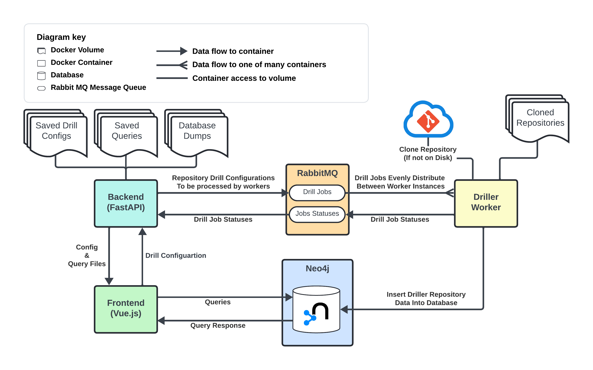

# Graph DB MSR Tool

A tool for mining software repositories and creating replication packages using a Neo4j Graph Database. This tool aims to do 3 things:

- Reduce scripting effort for drilling repository data.
- Provide a simple interface for querying drilled data.
- Allow easily creating a replication package which can be distributed.

## Executing the Project

This project is built with docker and must be run with docker:

1. Copy env from example:

```bash
cp .env.example .env
```

2. Run the docker container:

```bash
docker compose up -d
```

3. Change the permissions of the import directory. This is necessary so that the backend can access the import directory.

```bash
chmod -R 775 volumes/neo4j_import/
```

4. Navigate to <http://localhost:5173/>

## Structure of the System

The system is split into seperate docker containers that communicated between one another.



RabbitMQ is used for evenly distributing drill jobs between multiple instances of the driller workers.

## 3 Operating Modes

This application can be used in 3 different ways, catering to different use cases.

### 1. Interacting with an existing reproduction dataset

If you are here to interact with a replication package that was created by a line of research.

### 2. Reproduce a study using the replication package

For researchers who wish to validate the findings of the study.

### 3. Create a new study

For researchers who wish to start a new study from scratch with NeoRepro. The NeoRepro repository
must be cloned and used as a template for the new project.

## Configuring a Repository Drill

With the drilling yaml configuration you can extract data from a list of Git repositories. In the
tool you will find an example drill configuration. The schema is made up of two primary sections:

- `defaults`: Object containing default values which are used for each drill job.
- `repositores`: List of repositories to be drilled and the configuration for that drill. If a configuration is set in the `defaults` section but not in the individual configuration, then the default is applied.

Here is a snippet of a configuration from the Mining Cost awareness case study (https://github.com/AndrewRutherfoord/cloud-cost-awareness-NeoRepro-reproduction):

```YAML
defaults:
  delete_clone: false
  index_file_modifications: true
  pydriller:
    to: "2022-05-30"
    only_modifications_with_file_types:
      - '.tf'
      - '.tf.json'
  filters:
    commit:
      - field: 'msg'
        value:
          - cheap
          - expens
          - cost
          - efficient
          - bill
          - pay
        method: 'contains'

repositories:
- name: iks_vpc_lab
  url: https://github.com/ibm-cloud-architecture/iks_vpc_lab.git
  delete_clone: true
  pydriller:
      to: "2023-05-30"
- name: cloud-platform-terraform-monitoring
  url: https://github.com/ministryofjustice/cloud-platform-terraform-monitoring.git
- name: terraform-google-nat-gateway
  url: https://github.com/GoogleCloudPlatform/terraform-google-nat-gateway.git
```

### Defaults

The `defaults` object contains the following fields:

- `pydriller`: Object containing configurations for pydriller `Repository` class. This application uses pydriller under the hood to drill the repositories. All options explained at [pydriller](https://pydriller.readthedocs.io/en/latest/repository.html).
  - `since`: Date from which to start drilling. Format: YYYY-MM-DD
  - `to`: Date to which commits should be drilled. Format: YYYY-MM-DD
  - `from_commit`: A commit hash from which to start drilling.
  - `to_commit`: A commit hash to which commits should be drilled.
  - `from_tag`: A tag from which to start drilling.
  - `to_tag`: A tag to which commits should be drilled.
  - `only_in_branch`: Name of branch to be drilled.
  - `only_no_merge`: Boolean. If true, only commits that are not merged will be included.
  - `only_authors`: List of strings. Only commits by these authors will be included.
  - `only_commits`: List of strings. Commit hashes for commits to be included.
  - `only_release`: Boolean. Only commits that are tagged release will be included.
  - `filepath`: Only commits that modify this file will be included.
  - `only_modifications_with_file_types`: List of string. Only commits that modify files of this type will be included.
- `filters`: Object containing string filters.

  - `commit`: List of filters. (Shown below)

- `delete_clone`: Boolean. Indicates whether to delete the cloned repository after the drilling is complete.
- `index_file_modifications`: Boolean. Indicates whether to drill the modified files. If false, only the commits will be drilled.
- `index_file_diff`: Boolean. Indicates whether the file diffs should be indexed. If false, it won't be added to database.

#### Filters

A filter contains the following fields:

- `field`: The field to be checked for the filter.
- `value`: A string or list of strings. The value(s) to be checked for the filter. If list, then behaves as an `OR` (if field contains any of the values).
- `method`: Can be one of the following:
  - `contains`: The value is contained in the field.
  - `!contains`: The value is not contained in the field.
  - `exact`: The value is equal to the field.
  - `!exact`: The value is not equal to the field.

### Repositories

Each repository can contain all of the fields from `defaults` but must also contain the following fields:

- `name`: Name of the repository.
- `url`: Https url to the repository to clone it in the case it isn't already cloned.

If any values are not provided in the repository, the default values from `defaults` will be used.

### Executing the drill job

Once the drill configuration file has been composed on the frontend of NeoRepro, the `Execute`
button on the Drill configration page can be clicked in order to commence the drilling of the
repositories based on the configuration file.

To view the status of the drill jobs, navigate to the job status page of the frontend. Here you can
see which repositories are being drilled currenly, which are pending, which have failed and which
are complete.

The time taken to drill will vary widely depending on the configurations set earlier and the number
of Driller Workers that are running. By default NeoRepro has 3 Driller Workers running which will
drill 3 repositories simultaneously. If your computer can handle it, you can increase this by
changing the number of `replicas` in the Docker Compose file.

## Querying the dataset with Neo4j

Once the drilling is complete, all of the repository data will be contained in the Neo4j Graph
Database. The Cypher query language (https://neo4j.com/docs/cypher-manual/current/introduction/) can
be used to query the data. There are some example queries pre-populated in NeoRepro.

To query the dataset, navigate to http://localhost:5173/query . Saved queries can be found on the
left side. You can compose a new query by writing in the query box at the top of the page. Hitting
execute will send the query to the Neo4j and the response will be shown just below the query box.

You can download the result of the query in the JSON format.

Queries can also be executed through the Neo4j interface that comes with the Neo4j docker container.
This can be accessed at http://localhost:7474/

## Database Backups

At any point you can take a database backup of the current state. This will produce a `.cypher` file
which can be used to restore the database to it's current state. This is done on the manage DB page
(http://localhost:5173/manage-database). You can reload a snapshot of the database that you have
saved previously.

> **Warning!** Loading a database snapshot will delete the current data in the database.

On the manage DB page you can delete all data from the database if you would like.

The manage DB page also shows some general information about the current state of the database.
